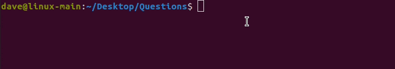

# cli-codeQ

Get coding questions instantly. A cli app that gets a number of coding question(s) of varying difficulty. Questions are web-scraped from reddit in real-time and saved as a formatted md files. The subreddit that the scraped questions are from is **/r/dailyprogrammer**. Choose an easy (default), intermediate, hard or random difficulty question. The application is implemented with **Python**, utilizing [click](https://github.com/pallets/click) package and [praw](https://github.com/praw-dev/praw) api wrapper.

## Demo


[Question_Example](https://github.com/sudo-dave/cli-codeQ/blob/main/Examples_Questions/Q%23342.md)

### Installation
```bash
$ git clone https://github.com/sudo-dave/cli-codeQ
$ python setup.py install
```
### Configure
Get free reddit api credentials [here](https://www.reddit.com/prefs/apps)
```bash
$ codeq config
Please enter your client_id:XXXXXXXX
Please enter your secret :XXXXXXXX
Please enter your user_agent :XXXXXXXX
Saved info @ /home/<user>/.reddit.cfg
```
### Usage
Default config-file location ```/home/<user>/.reddit.cfg```
```bash
$ codeq --help
#### Usage: codeq [OPTIONS] COMMAND [ARGS]...

  A cli app that returns a coding question(s) file of varying difficulty. The
  questions are web scrape from reddit. The subreddit that is scraped is from
  /r/dailyprogrammer. You can get free credentials from
  https://www.reddit.com/prefs/apps.

Options:
  --client-id TEXT        Your reddit client-id key
  --secret TEXT           Your reddit secret key
  --user-agent TEXT       Your reddit user_agent key
  -c, --config-file PATH
  --help                  Show this message and exit.

Commands:
  config  Store configuration values in a file.
  get     Get coding question(s).

#### Usage: codeq get [OPTIONS]

  Get coding question(s).

Options:
  --n INTEGER RANGE  The number of questions generated.  [default: 1;1<=x<=10]
  
  --diff [E|MD|H]    The difficulty of the questions. [Default is RANDOM difficulty]
                    
  --help             Show this message and exit.
```


